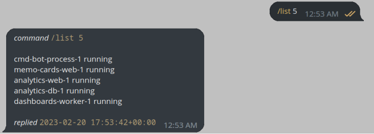

# Telegram Bot to call Docker API

Sending commands `/cmd container-name-1 <parameter>` through a Telegram client to execute a Docker Daemon's api method.

[In the the article](https://www.kvdm.dev/articles/telegram-bot-as-a-command-interface-for-docker-daemon/) you can find the full capabilities demonstrated.

## Requirements

- `pip install docker python-telegram-bot`

- mounting docker unix socket `docker run -v /var/run/docker.sock:/var/run/docker.sock`

